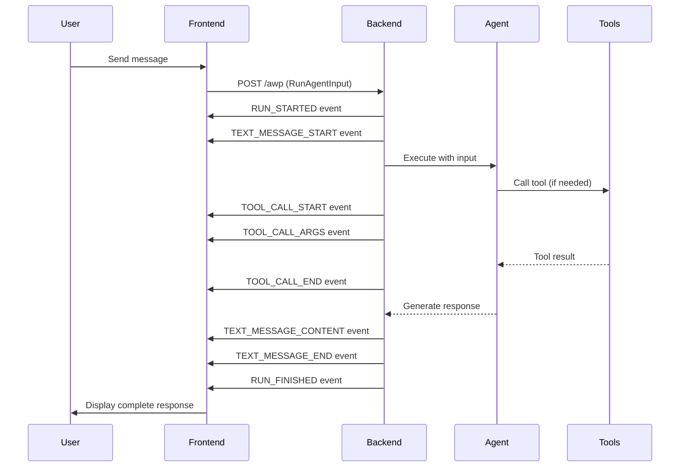
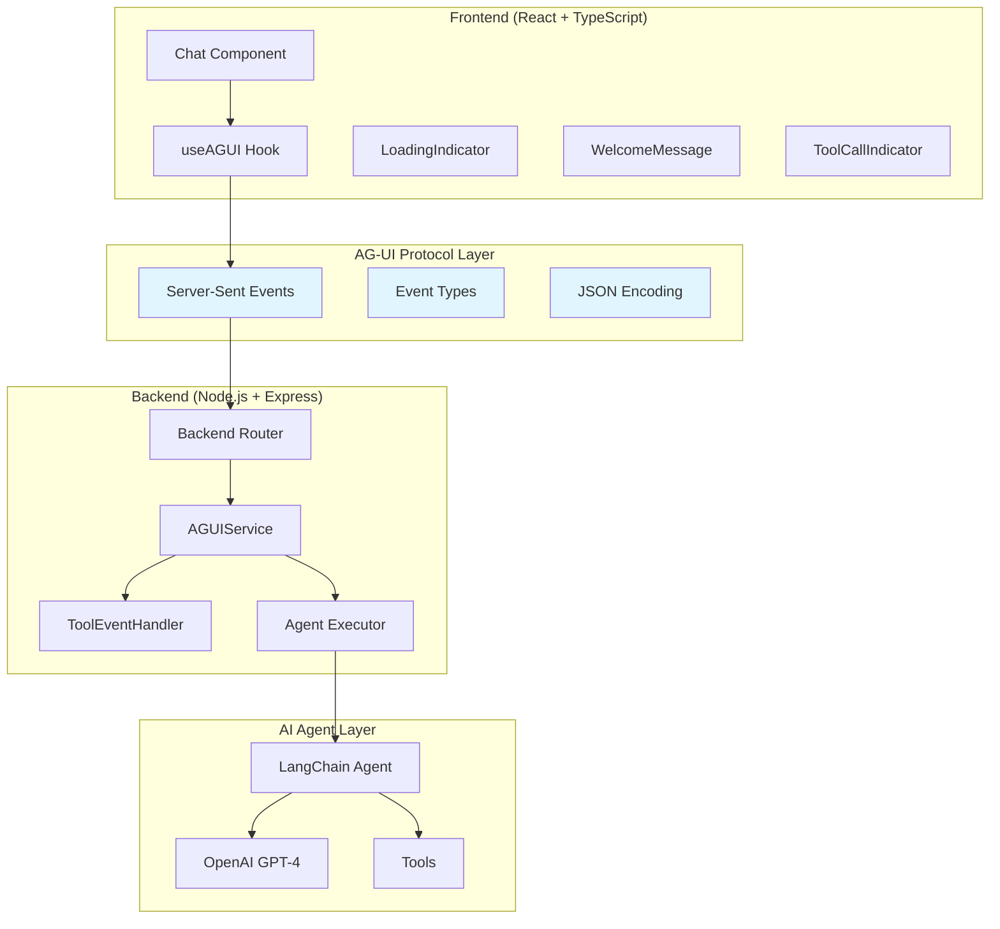

# AI Agents Gen UI with AG-UI Protocol

A comprehensive demonstration of AI agent development progression, from simple LLM calls to a full-featured AG-UI protocol implementation with real-time frontend interaction.

## 🎯 Project Overview

This repository showcases the evolution of AI agent development through 6 progressive examples, culminating in a complete implementation of the **AG-UI (Agent-User Interaction Protocol)** - an open, lightweight, event-based protocol that standardizes how AI agents connect to frontend applications.

## 📚 What is AG-UI Protocol?

**AG-UI** is a revolutionary protocol that bridges the gap between backend AI agents and frontend applications. Unlike traditional AI agents that work in isolation, AG-UI enables real-time, interactive collaboration between humans and AI agents.

### Key Features:
- 🔄 **Real-time streaming** of agent thoughts and actions
- 🛠️ **Tool orchestration** with live progress updates
- 📊 **State synchronization** between agent and UI
- 🤝 **Human-in-the-loop** collaboration
- 🔌 **Framework agnostic** - works with any agent backend
- 📡 **Event-driven** architecture using Server-Sent Events (SSE)

### AG-UI Event Flow Diagram



### AG-UI Architecture Diagram



## 🚀 Getting Started

### Prerequisites

- Node.js 18+ 
- npm or yarn
- OpenAI API key

### Environment Setup

1. **Clone and install dependencies:**
```bash
git clone https://github.com/domainio/AI-Agents-Gen-UI.git
cd AI-Agents-Gen-UI
npm install
```

2. **Set up environment variables:**
```bash
cp env.example .env
# Edit .env and add your OPENAI_API_KEY
```

## 📖 How to Run Each Example

### 1. Simple LLM Calls (`1-simple-llm-calls.ts`)
Demonstrates basic OpenAI API usage without memory.

```bash
npx tsx src/1-simple-llm-calls.ts
```

**What it shows:** Two separate API calls where the second call doesn't remember the first.

### 2. LLM with Memory (`2-llm-with-memory.ts`)
Interactive chat with conversation history.

```bash
npx tsx src/2-llm-with-memory.ts
```

**What it shows:** Persistent conversation where the AI remembers previous exchanges.

### 3. LLM No Live Data (`3-llm-no-live-data.ts`)
Simple static response example.

```bash
npx tsx src/3-llm-no-live-data.ts
```

**What it shows:** Basic LLM interaction without external data sources.

### 4. LLM with Tools (`4-llm-with-tools.ts`)
LLM enhanced with function calling capabilities.

```bash
npx tsx src/4-llm-with-tools.ts
```

**What it shows:** How to give LLMs access to external tools and APIs.

### 5. Agent with Tools (`5-agent-with-tools.ts`)
Full LangChain agent with reasoning and tool usage.

```bash
npx tsx src/5-agent-with-tools.ts
```

**What it shows:** Autonomous agent that can reason about when and how to use tools.

### 6. AG-UI Protocol Implementation

The crown jewel - a complete AG-UI protocol implementation with real-time frontend.

#### Backend Setup
```bash
# Install backend dependencies (already done in root)
npm run agui:backend
```

This starts the AG-UI backend server on `http://localhost:8000`

#### Frontend Setup
```bash
# Install frontend dependencies
npm run agui:install

# Start the development server
npm run agui:frontend
```


#### What the AG-UI Implementation Shows:

1. **Real-time Communication:** Live streaming of agent responses
2. **Tool Execution Visualization:** See tools being called in real-time
3. **State Synchronization:** Frontend stays in sync with agent state
4. **Modern UI/UX:** Beautiful, responsive chat interface
5. **Protocol Compliance:** Full AG-UI event specification implementation

## 🔧 AG-UI Protocol Deep Dive

### How AG-UI Works in This Project

#### Backend Components:

1. **`backend.ts`** - Express server with AG-UI endpoint
   - Handles CORS and request validation
   - Sets up Server-Sent Events (SSE) headers
   - Delegates to AGUIService

2. **`agui-service.ts`** - Core AG-UI protocol implementation
   - Manages the 4-step protocol flow:
     1. Start protocol flow (RUN_STARTED, TEXT_MESSAGE_START)
     2. Execute agent with tool event handling
     3. Send response content (TEXT_MESSAGE_CONTENT)
     4. Complete protocol flow (TEXT_MESSAGE_END, RUN_FINISHED)

3. **`tool-event-handler.ts`** - LangChain callback handler
   - Emits AG-UI events for tool execution:
     - `TOOL_CALL_START` - Tool invocation begins
     - `TOOL_CALL_ARGS` - Tool arguments
     - `TOOL_CALL_END` - Tool execution complete
     - `STEP_STARTED/FINISHED` - Step lifecycle

4. **`agent.ts`** - LangChain agent configuration
   - React agent with weather, stock, and calculator tools
   - Memory management for conversation context

#### Frontend Components:

1. **`useAGUI.ts`** - Custom React hook
   - Manages SSE connection to backend
   - Parses AG-UI events in real-time
   - Maintains conversation state and tool call tracking

2. **`Chat.tsx`** - Main chat interface
   - Renders messages and tool indicators
   - Handles user input and message sending

3. **`LoadingIndicator.tsx`** - Typing indicator
   - Shows when agent is processing

4. **`WelcomeMessage.tsx`** - Initial interface
   - Displays available features and capabilities

### AG-UI Event Types Used:

| Event Type | Purpose | Payload |
|------------|---------|---------|
| `RUN_STARTED` | Indicates agent execution began | `threadId`, `runId` |
| `TEXT_MESSAGE_START` | Message generation starts | `messageId`, `role` |
| `TEXT_MESSAGE_CONTENT` | Streaming message content | `messageId`, `delta` |
| `TEXT_MESSAGE_END` | Message generation complete | `messageId` |
| `TOOL_CALL_START` | Tool execution begins | `toolCallId`, `toolCallName` |
| `TOOL_CALL_ARGS` | Tool arguments provided | `toolCallId`, `delta` |
| `TOOL_CALL_END` | Tool execution complete | `toolCallId` |
| `RUN_FINISHED` | Agent execution complete | `threadId`, `runId` |

## 🧪 Testing the AG-UI Implementation

### Backend Testing
```bash
cd src/6-ag-ui-protocol/backend
chmod +x test-backend.sh
./test-backend.sh
```

### Manual Testing
1. Start both backend and frontend
2. Open `http://localhost:3001`
3. Try these example queries:
   - "What's the weather in New York?"
   - "What's the current price of AAPL stock?"
   - "Calculate 15% tip on $87.50"
   - "What's the weather in London and the stock price of TSLA?"

## 🎨 Key Features Demonstrated

### Real-time Tool Execution
Watch as the agent calls tools in real-time:
- Weather API calls for current conditions
- Stock price lookups via financial APIs  
- Mathematical calculations
- Multi-tool workflows

### Modern UI/UX
- Glassmorphism design with smooth animations
- Real-time typing indicators
- Tool execution progress visualization
- Responsive design for all devices

### Protocol Compliance
- Full AG-UI specification implementation
- Proper event sequencing and error handling
- Clean separation of concerns
- Enterprise-ready architecture

## 🔮 Why AG-UI Matters

AG-UI represents the future of human-AI interaction:

1. **Standardization:** No more custom protocols for each agent
2. **Interoperability:** Any AG-UI frontend works with any AG-UI backend
3. **Real-time Collaboration:** Humans and agents work together seamlessly
4. **Developer Experience:** Build faster with consistent patterns
5. **Enterprise Ready:** Security, scalability, and maintainability built-in

## 🤝 Contributing

This project demonstrates AG-UI protocol implementation. To contribute to the AG-UI protocol itself, visit the [official AG-UI repository](https://github.com/ag-ui-protocol/ag-ui).

## 📄 License

MIT License - see LICENSE file for details.

## 🔗 Resources

- [AG-UI Official Documentation](https://docs.ag-ui.com)
- [AG-UI GitHub Repository](https://github.com/ag-ui-protocol/ag-ui)
- [LangChain Documentation](https://langchain.readthedocs.io/)
- [OpenAI API Documentation](https://platform.openai.com/docs)

---

**Built with ❤️ to demonstrate the power of AG-UI protocol for real-time human-AI collaboration.**

